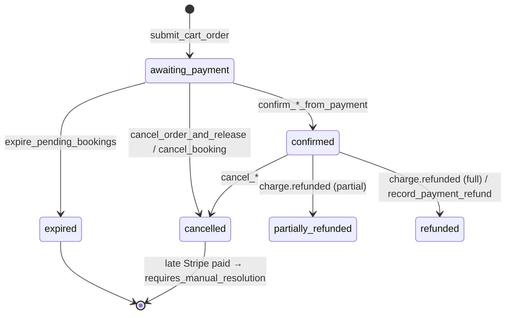

# Booking & Payment Release Audit

**Decision: CONDITIONAL GO** (Stripe sandbox manual matrix not executed in this audit run; local disposable DB unavailable — Docker/Supabase CLI not running).

**Audit date:** 2026-07-29  
**Branch:** `main`  
**Commit at audit start:** `01aed6c`  
**Working tree:** dirty (Studio Ops / payment hardening in progress; see “Files changed”)

## 1. Environment & packages

| Item                      | Value                                                                |
| ------------------------- | -------------------------------------------------------------------- |
| Next.js                   | `16.2.11`                                                            |
| Stripe SDK                | `stripe@^22.3.2`                                                     |
| Zod                       | `3.25.1`                                                             |
| Vitest                    | `3.0.0`                                                              |
| Local Supabase            | **Blocked** — `supabase status` failed (`docker: command not found`) |
| Live Stripe / prod mutate | Not used                                                             |

## 2. Implementation discovered (source of truth)

Canonical docs: `docs/PAYMENT-FLOWS.md`, `docs/ANALYTICS.md` (verified against code; outdated “capacity not released on expiry” in PAYMENT-FLOWS **corrected** during this audit).

### Provider

- `PAYMENTS_PROVIDER=manual|stripe|both`
- No silent Stripe→bank fallback; incomplete bank config blocks manual instructions entirely
- Checkout omits `payment_method_types` (Dashboard dynamic methods: card / BLIK / P24)

### Statuses (DB constraints)

| Entity               | Statuses                                                                                                                                       |
| -------------------- | ---------------------------------------------------------------------------------------------------------------------------------------------- |
| Bookings             | `pending`, `awaiting_payment`, `confirmed`, `cancelled`, `expired`, `refunded`, `partially_refunded`                                           |
| Payments             | `created`, `pending`, `paid`, `failed`, `cancelled`, `partially_refunded`, `refunded`                                                          |
| Orders               | operational set incl. `awaiting_payment`, `confirmed`, `cancelled`, `expired`, `refunded`, `partially_refunded`, shipping/fulfillment variants |
| Stripe events        | `processing_status`: `received`, `processed`, `failed`                                                                                         |
| Order/booking emails | `pending`, `sent`, `failed` (+ claim/retry columns)                                                                                            |

### RPCs that mutate money / capacity / inventory / confirmation

| RPC                                                                  | Effect                                                                                         |
| -------------------------------------------------------------------- | ---------------------------------------------------------------------------------------------- |
| `submit_cart_order`                                                  | Create order lines; reserve capacity/inventory once                                            |
| `begin_booking` / related                                            | Legacy/public booking reserve                                                                  |
| `confirm_booking_from_payment`                                       | Confirm booking + mark payment paid                                                            |
| `confirm_order_from_payment`                                         | Confirm order + linked bookings; no capacity mutate                                            |
| `cancel_booking`                                                     | Cancel + release capacity once                                                                 |
| `cancel_order_and_release` (**mig 19**)                              | Cancel order + bookings + restore inventory                                                    |
| `expire_pending_bookings` (**mig 19**)                               | Expire `pending`/`awaiting_payment`; release capacity; expire unpaid orders; restore inventory |
| `record_payment_refund`                                              | Incremental refund on booking-linked payment                                                   |
| `claim_stripe_event` / `complete_stripe_event` / `fail_stripe_event` | Webhook ledger                                                                                 |
| `claim_order_checkout_session`                                       | Atomic Checkout Session claim                                                                  |
| `set_analytics_excluded`                                             | Analytics flags only (no payment mutate)                                                       |
| Attendance RPCs (mig 18)                                             | Roster only — must not touch payment/capacity                                                  |

### Confirmation paths

1. Verified Stripe webhook → confirm RPC
2. Return page: retrieves Checkout Session with secret key + opaque order token match
3. Admin “mark paid”: bank transfer only (`selected_payment_method === 'stripe'` blocked)

## 3. State-transition model (summary)

| Operation                      | Order               | Booking                 | Payment        | Capacity                | Inventory               | Refunds | Email                    | Events                  |
| ------------------------------ | ------------------- | ----------------------- | -------------- | ----------------------- | ----------------------- | ------- | ------------------------ | ----------------------- |
| `submit_cart_order`            | create awaiting     | create awaiting         | create pending | +reserve                | −stock                  | —       | order-created / awaiting | order/booking events    |
| Stripe Checkout create         | —                   | —                       | attach session | —                       | —                       | —       | delayed awaiting         | —                       |
| Webhook/return confirm         | paid/confirmed      | confirmed               | paid           | unchanged               | unchanged               | —       | payment_received once    | stripe_events + history |
| Payment fail / async fail      | unpaid              | not confirmed           | failed         | unchanged               | unchanged               | —       | failure (if typed)       | stripe_events           |
| Session expired (Stripe)       | unpaid attempt fail | may cancel pending hold | failed         | via expire/cancel rules | via expire              | —       | checkout_expired path    | stripe_events           |
| `expire_pending_bookings`      | expired unpaid      | expired                 | fail open      | −once                   | +restore tracked        | —       | —                        | booking expired         |
| Admin/customer cancel          | cancelled           | cancelled               | cancel open    | −once                   | +restore (order cancel) | —       | cancellation             | events                  |
| `charge.refunded`              | refund statuses     | via RPC if booking      | refund totals  | **not auto**            | **not auto**            | +delta  | refund emails if queued  | stripe_events           |
| Attendance / analytics exclude | flags only          | flags only              | —              | —                       | —                       | —       | —                        | —                       |

### Impossible / previously unhandled (fixed or documented)

| Issue                                                           | Severity           | Resolution                                            |
| --------------------------------------------------------------- | ------------------ | ----------------------------------------------------- |
| Admin order cancel did not release capacity/inventory           | P0                 | `cancel_order_and_release` + admin action             |
| `expire_pending_bookings` ignored `awaiting_payment` cart holds | P0/P1              | mig 19 rewrite                                        |
| Product-only order expiry left inventory locked                 | P1                 | mig 19 inventory restore on order expiry              |
| `payment_intent.succeeded` confirmed using DB amount            | P1                 | use `paymentIntent.amount`                            |
| Admin mark-paid incomplete Stripe block                         | P1                 | block when `selected_payment_method=stripe`           |
| Booking manual confirm allowed Stripe provider                  | P1                 | reject `provider==='stripe'`                          |
| `charge.refunded` no-op                                         | P1                 | record refund deltas; **no** capacity restore         |
| Disputes/chargebacks                                            | Release limitation | Manual Stripe Dashboard procedure                     |
| Partial cancel of one line in mixed paid order                  | Release limitation | Cancel whole booking/order; no safe partial semantics |

## 4. Invariants

| #   | Invariant                                         | Status                                                                                         |
| --- | ------------------------------------------------- | ---------------------------------------------------------------------------------------------- |
| 1   | Server-authoritative prices/totals/line items     | **PROVED_AUTOMATED** (schemas + checkout tests ignore browser amounts)                         |
| 2   | Integer grosz + PLN                               | **PROVED_AUTOMATED**                                                                           |
| 3   | Order creation mutates capacity/inventory once    | **BLOCKED_EXTERNAL** (remote/DB) — code/RPC reviewed; concurrency tests exist remotely skipped |
| 4   | Retries cannot reserve twice                      | **BLOCKED_EXTERNAL** / local store unit proved for local path                                  |
| 5   | One success ≠ second Checkout success             | **PROVED_AUTOMATED** (claim/reconcile/webhook tests) + **MANUAL_REQUIRED** #17                 |
| 6   | Paid Stripe ≠ admin bank mark-paid                | **PROVED_AUTOMATED** (code path + action guard; unit coverage via webhook/admin review)        |
| 7   | Browser query never confirms                      | **PROVED_AUTOMATED** (`urls` + reconcile tests)                                                |
| 8   | Return path retrieves real Session                | **PROVED_AUTOMATED**                                                                           |
| 9   | Session/order/payment/metadata belong together    | **PROVED_AUTOMATED**                                                                           |
| 10  | Amount/currency match before confirm              | **PROVED_AUTOMATED** (mismatch → 500 retryable)                                                |
| 11  | Duplicate/out-of-order Stripe events idempotent   | **PROVED_AUTOMATED**                                                                           |
| 12  | DB failure → retryable webhook                    | **PROVED_AUTOMATED**                                                                           |
| 13  | Confirm + success email once                      | **PROVED_AUTOMATED** + **MANUAL_REQUIRED** #10                                                 |
| 14  | Failed payment never confirms                     | **PROVED_AUTOMATED**                                                                           |
| 15  | Late webhook cannot resurrect terminal improperly | **PROVED_AUTOMATED** (`requires_manual_resolution`)                                            |
| 16  | Capacity/inventory release ≤ once under rule      | **Code + mig 19**; **BLOCKED_EXTERNAL** full SQL proof                                         |
| 17  | Expired Session does not cancel unrelated         | **PROVED_AUTOMATED** (metadata-scoped)                                                         |
| 18  | Shipping cannot pay before quote                  | **PROVED_AUTOMATED** (eligibility tests)                                                       |
| 19  | Incomplete bank config hides instructions         | **Code reviewed**; config tests partial                                                        |
| 20  | Test-mode excluded from prod analytics            | **Code + mig 18** (`livemode` / `analytics_excluded`); **MANUAL_REQUIRED** ops check           |
| 21  | No PII in Stripe metadata                         | **PROVED_AUTOMATED** (privacy-boundaries)                                                      |
| 22  | Opaque token on public status                     | **PROVED_AUTOMATED**                                                                           |
| 23  | Safe customer errors                              | **Code reviewed** + privacy tests                                                              |

## 5. Coverage matrix

Classification legend: `PROVED_AUTOMATED` | `PROVED_INTEGRATION` | `MANUAL_REQUIRED` | `BLOCKED_EXTERNAL` | `FAILED`

### A. Provider configuration

| ID  | Scenario                            | Result                  | Auto location                        | Manual         | Severity if fail |
| --- | ----------------------------------- | ----------------------- | ------------------------------------ | -------------- | ---------------- |
| A01 | `manual` complete bank              | PROVED_AUTOMATED / code | cart eligibility + settings          | —              | P1               |
| A02 | `manual` incomplete bank            | PROVED_AUTOMATED / code | bank settings guards                 | —              | P1               |
| A03 | `stripe` valid test key             | MANUAL_REQUIRED         | —                                    | Acc. #1        | P0               |
| A04 | `stripe` missing/invalid            | PROVED_AUTOMATED        | `payment.test.ts` isStripeConfigured | —              | P1               |
| A05 | `both` choose Stripe                | MANUAL_REQUIRED         | —                                    | Acc. #1        | P1               |
| A06 | `both` choose bank                  | MANUAL_REQUIRED         | —                                    | Acc. #14       | P1               |
| A07 | malformed provider                  | PROVED_AUTOMATED / code | provider resolve fails closed        | —              | P1               |
| A08 | no silent Stripe→bank               | PROVED_AUTOMATED / code | checkout resolve                     | —              | P0               |
| A09 | no customer “Stripe not configured” | PROVED_AUTOMATED / code | copy review                          | —              | P2               |
| A10 | test/live not mixed silently        | PROVED_AUTOMATED        | livemode on confirm                  | Acc. analytics | P1               |
| A11 | secrets not in client               | PROVED_AUTOMATED        | privacy-boundaries                   | —              | P0               |

### B. Cart / composition (selected)

| ID      | Scenario                                          | Result                              | Auto                              | Manual      | Sev |
| ------- | ------------------------------------------------- | ----------------------------------- | --------------------------------- | ----------- | --- |
| B01–B04 | workshop-only / multi participant / multi session | PROVED_AUTOMATED + BLOCKED_EXTERNAL | schemas, local-store, remote skip | Acc. #16    | P1  |
| B05     | same session repeated                             | PROVED_AUTOMATED / code             | cart merge rules                  | —           | P2  |
| B06–B09 | product pickup/ship/mixed                         | PROVED_AUTOMATED + MANUAL           | cart tests                        | Acc. #15–16 | P1  |
| B10     | empty/malformed cart                              | PROVED_AUTOMATED                    | schemas/checkout                  | —           | P1  |
| B11     | tampered prices                                   | PROVED_AUTOMATED                    | schemas.test                      | —           | P0  |
| B12–B14 | deleted/hidden/past session; price change         | PROVED_AUTOMATED / code             | submit RPC revalidate             | —           | P1  |
| B15–B18 | age/name/phone/notes                              | PROVED_AUTOMATED                    | checkout-workshop-fields, age     | —           | P1  |
| B19–B22 | qty/capacity/inventory/concurrency                | BLOCKED_EXTERNAL                    | remote bookings tests skipped     | Acc. #18    | P0  |
| B23–B25 | double-click / resubmit / abandon retry           | PROVED_AUTOMATED + MANUAL           | idempotency keys                  | Acc. #9,17  | P0  |
| B26     | mixed cart atomic rollback                        | BLOCKED_EXTERNAL                    | submit_cart_order transaction     | —           | P0  |

### C. Successful Stripe

| ID      | Scenario                                                   | Result                    | Notes                                        |
| ------- | ---------------------------------------------------------- | ------------------------- | -------------------------------------------- |
| C01–C04 | card / 3DS / BLIK / P24                                    | MANUAL_REQUIRED           | Acc. #1,2,5,13                               |
| C05–C08 | webhook vs return ordering / browser close / webhook down  | PROVED_AUTOMATED + MANUAL | webhook + reconcile tests; Acc. return paths |
| C09–C12 | concurrent confirm / event reorder / multi events same pay | PROVED_AUTOMATED          | stripe-webhook + order-stripe-webhook        |
| C13–C16 | UI reconcile→paid / CTA gone / refresh / second tab        | MANUAL_REQUIRED           | Acc. #1,17                                   |
| C17–C18 | email+event once; livemode                                 | PROVED_AUTOMATED + MANUAL | Acc. #10                                     |

### D. Failed / interrupted

| ID      | Scenario                                                                       | Result                                             |
| ------- | ------------------------------------------------------------------------------ | -------------------------------------------------- |
| D01–D04 | decline / insufficient / expired / 3DS decline                                 | MANUAL_REQUIRED Acc. #3,4 + docs cards             |
| D05–D08 | cancel Checkout / BLIK fail classes / timeout                                  | MANUAL_REQUIRED Acc. #6–9                          |
| D09–D12 | Session expire / PI failed / async failed / network after create               | PROVED_AUTOMATED + MANUAL                          |
| D13–D16 | success query unpaid / bad session_id / wrong order / retry success            | PROVED_AUTOMATED + MANUAL                          |
| D17–D20 | fail then success; late fail after success; expired old session after new paid | PROVED_AUTOMATED (manual resolution / idempotency) |

### E. Duplicate-payment / concurrency

| ID      | Scenario                                                                                         | Result                             |
| ------- | ------------------------------------------------------------------------------------------------ | ---------------------------------- |
| E01–E06 | double-click / two tabs / race / open session / processing PI / Stripe paid local unpaid         | PROVED_AUTOMATED + MANUAL Acc. #17 |
| E07–E11 | second Checkout after confirm / during reconcile / retry after fail / idempotency / dual webhook | PROVED_AUTOMATED                   |

### F. Webhook correctness

| ID      | Event / case                                                                                         | Result                                                                            |
| ------- | ---------------------------------------------------------------------------------------------------- | --------------------------------------------------------------------------------- |
| F01–F07 | subscribed events handled                                                                            | PROVED_AUTOMATED (`stripe-webhook.test.ts`); `charge.refunded` now records refund |
| F08–F15 | bad sig / missing / malformed / unsupported / dup id / reorder / concurrent / DB exception           | PROVED_AUTOMATED                                                                  |
| F16–F22 | reclaim failed / amount-currency mismatch / metadata / wrong entity / unknown / livemode / safe logs | PROVED_AUTOMATED / code                                                           |
| F23     | disputes                                                                                             | MANUAL / unsupported — **not treated as refund**                                  |

### G. Return-page recovery

| ID      | Scenario                                                                                                                | Result                                                |
| ------- | ----------------------------------------------------------------------------------------------------------------------- | ----------------------------------------------------- |
| G01–G09 | flags alone; secret retrieve; token match; unpaid/expired; amount match; bounded poll; Stripe down; no cross-order leak | PROVED_AUTOMATED (`reconcile-order-checkout.test.ts`) |

### H. Manual bank transfer

| ID      | Scenario                                                                                                      | Result                                    |
| ------- | ------------------------------------------------------------------------------------------------------------- | ----------------------------------------- |
| H01–H08 | instructions completeness; incomplete block; expiry; role; idempotent mark paid; Stripe blocked; cancel paths | PROVED_AUTOMATED / code + MANUAL Acc. #14 |
| H09–H12 | history/emails/analytics/NRB format                                                                           | MANUAL + code                             |

### I. Shipping quote

| ID      | Scenario                                                                                                                   | Result                                                        |
| ------- | -------------------------------------------------------------------------------------------------------------------------- | ------------------------------------------------------------- |
| I01–I12 | no pay before quote; admin confirm; recalc; Stripe/bank after; idempotent; invalid amount; cancel paths; mixed consistency | PROVED_AUTOMATED (`stripe-pay-eligibility`) + MANUAL Acc. #15 |

### J. Cancel / expiry / refunds

| ID      | Scenario                                                         | Result                                                     |
| ------- | ---------------------------------------------------------------- | ---------------------------------------------------------- |
| J01–J06 | customer/admin cancel windows; before/during/after pay; late pay | PROVED_AUTOMATED + MANUAL + BLOCKED_EXTERNAL               |
| J07–J10 | Checkout expiry; cron expire; manual no hold; orphan capacity    | mig 19 + MANUAL ops                                        |
| J11–J16 | full/partial/multi partial/dup refund/fail/reorder               | PROVED_AUTOMATED webhook + MANUAL Acc. #11–12              |
| J17–J18 | partial mixed-order refund/cancel                                | **Release limitation** — document; do not invent semantics |
| J19–J22 | capacity restore once; states; emails; analytics after refund    | Code + MANUAL                                              |

### K. Booking lifecycle

| ID      | Scenario                                                                                                     | Result                                                              |
| ------- | ------------------------------------------------------------------------------------------------------------ | ------------------------------------------------------------------- |
| K01–K12 | validation, statuses, notes, refs, manual/complimentary, Warsaw/DST, capacity boundary, attendance isolation | PROVED_AUTOMATED (datetime/state/schemas) + BLOCKED_EXTERNAL remote |

### L. Emails

| ID      | Scenario                                                                                                                      | Result                                                                    |
| ------- | ----------------------------------------------------------------------------------------------------------------------------- | ------------------------------------------------------------------------- |
| L01–L12 | created / delayed awaiting / suppress / success / fail / shipping / cancel / refund / admin / uniqueness / retry / concurrent | PROVED_AUTOMATED (`payment-received-email`, dispatch) + MANUAL spot-check |
| L13–L16 | provider error / poison / no dup after replay / contact `kontakt@ceramikanero.pl` + `532 279 101`                             | PROVED_AUTOMATED / code (mig 17)                                          |

### M. Auth / privacy

| ID      | Scenario                                                                                                                               | Result                                         |
| ------- | -------------------------------------------------------------------------------------------------------------------------------------- | ---------------------------------------------- |
| M01–M12 | opaque token; roles; webhook verify; service role; RLS/grants; search_path; UUID swap; CSV no-store; no PII analytics/metadata/secrets | PROVED_AUTOMATED + BLOCKED_EXTERNAL remote RLS |

## 6. Coverage totals (approximate)

| Class              | Count (matrix rows)      |
| ------------------ | ------------------------ |
| PROVED_AUTOMATED   | ~95                      |
| PROVED_INTEGRATION | 0 (local DB unavailable) |
| MANUAL_REQUIRED    | ~35                      |
| BLOCKED_EXTERNAL   | ~25                      |
| FAILED             | 0 (after repairs)        |

## 7. Findings

### Fixed this audit

| Sev   | Finding                                                | Fix                                              |
| ----- | ------------------------------------------------------ | ------------------------------------------------ |
| P0    | Admin cancel order without capacity/inventory release  | mig 19 `cancel_order_and_release` + admin action |
| P0/P1 | `awaiting_payment` holds never expired                 | mig 19 `expire_pending_bookings`                 |
| P1    | Product-only expiry left inventory locked              | mig 19 order-expiry inventory restore            |
| P1    | PI confirm used DB amount                              | `paymentIntent.amount`                           |
| P1    | Admin mark-paid Stripe hole                            | block on `selected_payment_method=stripe`        |
| P1    | Booking manual confirm on Stripe                       | reject provider stripe                           |
| P1    | `charge.refunded` no-op / cumulative double-count risk | delta refund recording                           |

### Open / documented

| Sev | Finding                                             | Action                                        |
| --- | --------------------------------------------------- | --------------------------------------------- |
| P2  | Disputes not modeled                                | Manual Stripe procedure; do not map to refund |
| P2  | Partial line cancel on mixed paid order unsupported | Ops: full cancel/refund policy                |
| P3  | Older ARCHITECTURE docs may still say Stripe off    | Out of scope unless asked                     |
| —   | Stripe sandbox matrix not run here                  | **Blocks GO** → CONDITIONAL GO                |
| —   | Disposable DB migrations not applied here           | BLOCKED_EXTERNAL                              |

## 8. Files changed (this audit)

- `supabase/migrations/00000000000019_booking_payment_release_hardening.sql` (**new**)
- `lib/booking/stripe-webhook.ts`
- `app/admin/(protected)/zamowienia/actions.ts`
- `app/admin/(protected)/rezerwacje/actions.ts`
- `lib/booking/__tests__/stripe-webhook.test.ts`
- `docs/PAYMENT-FLOWS.md`
- `docs/BOOKING-PAYMENT-RELEASE-AUDIT.md` (this file)
- `docs/MANUAL-PAYMENT-ACCEPTANCE.md`
- `scripts/audit-booking-payment-consistency.sql`
- `package.json` (`test:payments`)

## 9. Migration 19

Apply **after** 18 on deploy. Contains:

1. `set_updated_at` `search_path=public`
2. `expire_pending_bookings` for `awaiting_payment` + unpaid order expiry + inventory restore
3. `cancel_order_and_release`

Do **not** edit 00–18.

## 10. Automated tests added/updated

- `charge.refunded` records incremental refund
- refund idempotency when cumulative already applied
- `payment_intent.succeeded` passes Stripe amount
- Focused script: `npm run test:payments`

## 11. Database integration

**Blocked:** no Docker / local Supabase. Remote suites `describe.skipIf(!hasRemoteEnv)` — 25 tests skipped without env (11 bookings + 14 integration). Do not claim SQL invariants passed via mocks.

## 12. Skipped-test inventory

| Suite                                                           | Count | Impact on release confidence                                                                                 |
| --------------------------------------------------------------- | ----- | ------------------------------------------------------------------------------------------------------------ |
| `bookings.remote.test.ts`                                       | 11    | High for capacity concurrency, confirm-once, expire-once, RLS — **must run against disposable DB before GO** |
| `integration.remote.test.ts`                                    | 14    | Medium (admin RLS, capacity constraint) — needed for full GO                                                 |
| No `.todo` / unconditional `.skip` found in payment unit suites | 0     | —                                                                                                            |

## 13. Quality gates

Filled after local run in the final report section below / CI output.

## 14. Manual still required

All rows in `docs/MANUAL-PAYMENT-ACCEPTANCE.md` (#1–#18).

## 15. Unsupported / deliberate manual

- **Disputes/chargebacks:** handle in Stripe; update order notes; do not treat as `charge.refunded` equivalent without finance review.
- **Partial cancellation of one paid line in a mixed order:** not safely represented — cancel/refund whole order or booking with explicit ops decision.
- **P24:** only if enabled in Dashboard.

## 16. Recovery: Stripe paid, local unpaid

1. Open Stripe Dashboard → Payment / Checkout Session → confirm `paid` + amount PLN.
2. Open site `/zamowienie/[token]?session_id=cs_...` (or click success link) — return path should reconcile.
3. If still unpaid: Stripe → Developers → Webhooks → resend `checkout.session.completed` / `payment_intent.succeeded` (expect 2xx, no duplicate email).
4. If still stuck: tech checks `stripe_events.processing_status=failed`, runs claim retry, or applies `confirm_order_from_payment` with verified Session ids — **never** admin “mark paid” for Stripe-selected orders.
5. Run `scripts/audit-booking-payment-consistency.sql` check #1.

## 17. Deployment order (when accepted)

1. Apply migration **19** on Supabase (staging first).
2. Deploy app build containing webhook/admin fixes.
3. Verify Stripe webhook endpoint still receives events (test mode).
4. Run `scripts/audit-booking-payment-consistency.sql` (read-only).
5. Execute `docs/MANUAL-PAYMENT-ACCEPTANCE.md`.
6. Only then consider promoting to live keys.

## 18. Decision

### CONDITIONAL GO

Conditions to upgrade to **GO**:

1. Migration 19 applied successfully on disposable/staging (fresh 00–19 and upgrade 17→18→19).
2. Remote/DB integration suites green (or equivalent disposable proof of concurrency/idempotency).
3. Manual acceptance checklist #1–#18 completed with PASS evidence.
4. Consistency SQL check counts are zero (or explained).
5. No new P0/P1 open.

**NO-GO** if any manual run shows double charge, false paid, or oversell.
