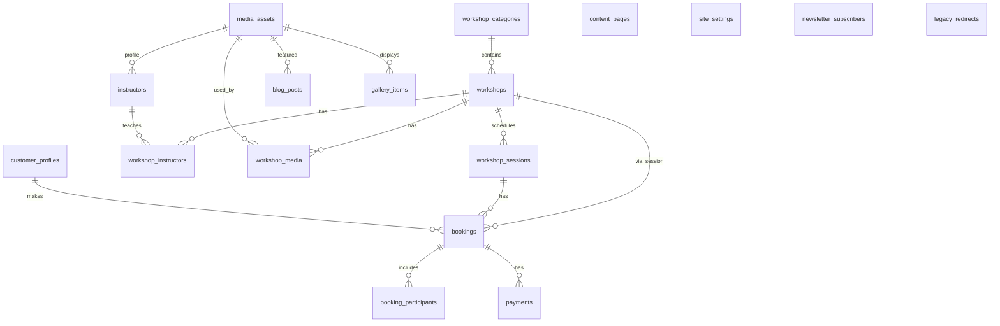

# Database

## Overview

The application uses Supabase (PostgreSQL) as its primary database. The schema is
managed through versioned SQL migrations in `supabase/migrations/` and matches
the manual TypeScript types in `lib/database/types.ts`.

This phase establishes the production data foundation for workshops, sessions,
customers, bookings, payments, content, media and Wix redirects. No remote
Supabase project was modified automatically.

## Migration workflow

- Migrations are stored in `supabase/migrations/` with sequential timestamps.
- The initial migration is `00000000000000_initial_schema.sql`.
- `00000000000001_admin_auth.sql` adds the admin role layer, audit log, media bucket
  and admin RLS policies.
- `00000000000002_workshop_external_url.sql` adds `external_booking_url` to workshops.
- `00000000000003_workshop_admin_functions.sql` adds the atomic
  `upsert_workshop_with_relations` function.
- Seed data is in `supabase/seed.sql` and is suitable for local development only.
- When a real Supabase project is available, run:
  - `supabase migration up` to apply locally, or
  - `supabase db push` to apply to a linked project.
- Do not apply migrations to a remote project unless explicitly asked.
- Target project reference for this project: `zorxzyvmcbwucvaywmuu`.

## Type-generation workflow

- `lib/database/types.ts` is the hand-maintained barrel used by the rest of
  the application. It imports from the generated Supabase types and from the
  custom domain types defined in `lib/database/domain.ts`.
- `lib/database/domain.ts` contains application/domain types (camelCase public
  shapes, string-literal enums, and composite types) that must never be erased by
  a regeneration.
- Once a Supabase project is connected, generate types with:
  `set SUPABASE_PROJECT_REF=<project-ref> && npm run db:types`
- The script writes the generated Supabase client types to
  `lib/database/generated-types.ts` and leaves `lib/database/types.ts` and
  `lib/database/domain.ts` untouched. After the first generation, replace the
  manual Database type in `lib/database/types.ts` with an import from
  `lib/database/generated-types.ts` and a re-export of `lib/database/domain.ts`.

## Entity-relationship diagram

## Schema

### `media_assets`

Storage metadata for uploaded, imported and generated images/files.

| Column            | Type        | Notes                                        |
| ----------------- | ----------- | -------------------------------------------- |
| id                | uuid (pk)   | gen_random_uuid()                            |
| original_filename | text        | Exact original filename from Wix or uploader |
| storage_bucket    | text        | Supabase Storage bucket name                 |
| storage_path      | text unique | Unique storage path                          |
| mime_type         | text        | MIME type of the asset                       |
| width             | integer     | Pixels, nullable                             |
| height            | integer     | Pixels, nullable                             |
| file_size_bytes   | integer     | Nullable                                     |
| alt_text          | text        | Default empty string                         |
| caption           | text        | Nullable                                     |
| source            | text        | upload, wix_import, generated                |
| wix_url           | text        | Nullable original Wix URL                    |
| checksum          | text        | Nullable                                     |
| created_at        | timestamptz | UTC                                          |
| updated_at        | timestamptz | UTC, auto-updated                            |
| archived_at       | timestamptz | Soft deletion                                |

### `workshop_categories`

Editable categories for grouping workshops.

| Column          | Type        | Notes                       |
| --------------- | ----------- | --------------------------- |
| id              | uuid (pk)   |                             |
| name            | text        | Display name                |
| slug            | text unique | URL slug, e.g. `dla-dzieci` |
| description     | text        | Nullable                    |
| suggested_theme | text        | atelier or joyful           |
| display_order   | integer     | Default 0                   |
| is_visible      | boolean     | Default true                |
| created_at      | timestamptz |                             |
| updated_at      | timestamptz |                             |

### `instructors`

Public instructor profiles. Minimal PII is stored.

| Column           | Type        | Notes                    |
| ---------------- | ----------- | ------------------------ |
| id               | uuid (pk)   |                          |
| display_name     | text        | Public name              |
| slug             | text unique | URL slug                 |
| biography        | text        | Nullable                 |
| profile_media_id | uuid        | FK to media_assets, null |
| is_active        | boolean     | Default true             |
| display_order    | integer     | Default 0                |
| created_at       | timestamptz |                          |
| updated_at       | timestamptz |                          |

### `workshops`

Core workshop definitions.

| Column                    | Type        | Notes                                         |
| ------------------------- | ----------- | --------------------------------------------- |
| id                        | uuid (pk)   |                                               |
| category_id               | uuid        | FK to workshop_categories                     |
| title                     | text        |                                               |
| slug                      | text unique | URL slug                                      |
| short_description         | text        | Nullable                                      |
| description               | text        | Plain text or documented safe rich-text (TBD) |
| practical_information     | text        | Nullable                                      |
| minimum_age               | integer     | Nullable                                      |
| maximum_age               | integer     | Nullable                                      |
| default_duration_minutes  | integer     | Must be > 0                                   |
| default_capacity          | integer     | Must be > 0                                   |
| default_price_gross_grosz | integer     | Must be >= 0, in grosz                        |
| currency                  | text        | Fixed to PLN                                  |
| suggested_theme           | text        | Nullable, atelier or joyful                   |
| featured_media_id         | uuid        | FK to media_assets, nullable                  |
| booking_mode              | text        | scheduled, enquiry, external                  |
| external_booking_url      | text        | Nullable, required for external booking mode  |
| status                    | text        | draft, published, archived                    |
| is_featured               | boolean     | Default false                                 |
| seo_title                 | text        | Nullable                                      |
| seo_description           | text        | Nullable                                      |
| created_at                | timestamptz |                                               |
| updated_at                | timestamptz |                                               |
| archived_at               | timestamptz | Soft deletion                                 |

### `workshop_instructors`

Many-to-many relationship between workshops and instructors.

| Column        | Type    | Notes            |
| ------------- | ------- | ---------------- |
| workshop_id   | uuid    | FK, composite PK |
| instructor_id | uuid    | FK, composite PK |
| display_order | integer | Default 0        |

### `workshop_sessions`

Scheduled instances of workshops. Times are stored in UTC; `timezone` stores the
IANA display timezone (default `Europe/Warsaw`).

| Column               | Type        | Notes                                              |
| -------------------- | ----------- | -------------------------------------------------- |
| id                   | uuid (pk)   |                                                    |
| workshop_id          | uuid        | FK to workshops                                    |
| instructor_id        | uuid        | FK to instructors, nullable                        |
| starts_at            | timestamptz | UTC, must be before ends_at                        |
| ends_at              | timestamptz | UTC, must be after starts_at                       |
| timezone             | text        | IANA timezone, default Europe/Warsaw               |
| capacity             | integer     | Must be > 0                                        |
| reserved_count       | integer     | Default 0, cached value, 0 <= reserved <= capacity |
| price_gross_grosz    | integer     | Must be >= 0                                       |
| currency             | text        | Fixed to PLN                                       |
| location_name        | text        | Nullable                                           |
| location_address     | text        | Nullable                                           |
| status               | text        | draft, scheduled, sold_out, cancelled, completed   |
| booking_opens_at     | timestamptz | Nullable                                           |
| booking_closes_at    | timestamptz | Nullable                                           |
| external_booking_url | text        | Nullable                                           |
| created_at           | timestamptz |                                                    |
| updated_at           | timestamptz |                                                    |

### `customer_profiles`

Customer records. Designed so Wix customers can be imported before creating
Supabase Auth accounts.

| Column                 | Type        | Notes                          |
| ---------------------- | ----------- | ------------------------------ |
| id                     | uuid (pk)   |                                |
| auth_user_id           | uuid unique | Nullable link to Supabase Auth |
| email                  | text        | Not null                       |
| first_name             | text        | Not null                       |
| last_name              | text        | Not null                       |
| phone                  | text        | Nullable                       |
| preferred_language     | text        | Default pl                     |
| marketing_consent      | boolean     | Default false                  |
| marketing_consent_at   | timestamptz | Nullable                       |
| privacy_policy_version | text        | Nullable                       |
| created_at             | timestamptz |                                |
| updated_at             | timestamptz |                                |
| archived_at            | timestamptz | Soft deletion                  |

### `bookings`

Central booking record with snapshotted prices.

| Column                  | Type        | Notes                                                                                  |
| ----------------------- | ----------- | -------------------------------------------------------------------------------------- |
| id                      | uuid (pk)   |                                                                                        |
| booking_reference       | text unique | Generated automatically, e.g. CN-20260723-A3F1                                         |
| customer_id             | uuid        | FK to customer_profiles                                                                |
| workshop_session_id     | uuid        | FK to workshop_sessions                                                                |
| status                  | text        | pending, awaiting_payment, confirmed, cancelled, expired, refunded, partially_refunded |
| quantity                | integer     | Must be > 0                                                                            |
| unit_price_gross_grosz  | integer     | Must be >= 0                                                                           |
| total_price_gross_grosz | integer     | Must be >= 0, equals quantity * unit_price                                             |
| currency                | text        | Fixed to PLN                                                                           |
| customer_notes          | text        | Nullable                                                                               |
| internal_notes          | text        | Nullable                                                                               |
| source                  | text        | website, admin, wix_import                                                             |
| terms_accepted_at       | timestamptz | Not null                                                                               |
| privacy_policy_version  | text        | Not null                                                                               |
| expires_at              | timestamptz | Nullable                                                                               |
| confirmed_at            | timestamptz | Nullable                                                                               |
| cancelled_at            | timestamptz | Nullable                                                                               |
| created_at              | timestamptz |                                                                                        |
| updated_at              | timestamptz |                                                                                        |

### `booking_participants`

Participants attached to a booking. No dates of birth are collected.

| Column              | Type        | Notes                     |
| ------------------- | ----------- | ------------------------- |
| id                  | uuid (pk)   |                           |
| booking_id          | uuid        | FK to bookings            |
| display_name        | text        | Nullable                  |
| age                 | integer     | Nullable                  |
| participant_type    | text        | adult, child, unspecified |
| accessibility_notes | text        | Nullable                  |
| created_at          | timestamptz |                           |
| updated_at          | timestamptz |                           |

### `payments`

Provider-neutral payment ledger. No card details are stored. Stripe integration
is a future phase.

| Column                 | Type        | Notes                                                                   |
| ---------------------- | ----------- | ----------------------------------------------------------------------- |
| id                     | uuid (pk)   |                                                                         |
| booking_id             | uuid        | FK to bookings                                                          |
| provider               | text        | Payment provider name                                                   |
| provider_payment_id    | text        | Nullable                                                                |
| provider_checkout_id   | text        | Nullable                                                                |
| status                 | text        | created, pending, paid, failed, cancelled, partially_refunded, refunded |
| amount_gross_grosz     | integer     | Must be >= 0                                                            |
| currency               | text        | Fixed to PLN                                                            |
| idempotency_key        | text unique | Nullable                                                                |
| failure_code           | text        | Nullable                                                                |
| failure_message        | text        | Nullable                                                                |
| paid_at                | timestamptz | Nullable                                                                |
| refunded_amount_grosz  | integer     | Default 0, must be >= 0                                                 |
| raw_provider_reference | text        | Nullable                                                                |
| created_at             | timestamptz |                                                                         |
| updated_at             | timestamptz |                                                                         |

### `workshop_media`

Links media assets to workshops with a role.

| Column         | Type    | Notes                     |
| -------------- | ------- | ------------------------- |
| workshop_id    | uuid    | FK, composite PK          |
| media_asset_id | uuid    | FK, composite PK          |
| role           | text    | featured, gallery, detail |
| display_order  | integer | Default 0                 |

### `content_pages`

CMS-like pages for the public website.

| Column          | Type        | Notes                         |
| --------------- | ----------- | ----------------------------- |
| id              | uuid (pk)   |                               |
| title           | text        |                               |
| slug            | text unique |                               |
| excerpt         | text        | Nullable                      |
| content         | text        | Plain text or rich-text (TBD) |
| status          | text        | draft, published, archived    |
| suggested_theme | text        | Nullable, atelier or joyful   |
| seo_title       | text        | Nullable                      |
| seo_description | text        | Nullable                      |
| published_at    | timestamptz | Nullable                      |
| created_at      | timestamptz |                               |
| updated_at      | timestamptz |                               |
| archived_at     | timestamptz | Soft deletion                 |

### `blog_posts`

Blog articles.

| Column            | Type        | Notes                        |
| ----------------- | ----------- | ---------------------------- |
| id                | uuid (pk)   |                              |
| title             | text        |                              |
| slug              | text unique |                              |
| excerpt           | text        | Not null                     |
| content           | text        | Not null                     |
| featured_media_id | uuid        | FK to media_assets, nullable |
| status            | text        | draft, published, archived   |
| author_name       | text        | Nullable                     |
| published_at      | timestamptz | Nullable                     |
| seo_title         | text        | Nullable                     |
| seo_description   | text        | Nullable                     |
| legacy_wix_url    | text        | Nullable                     |
| created_at        | timestamptz |                              |
| updated_at        | timestamptz |                              |
| archived_at       | timestamptz | Soft deletion                |

### `gallery_items`

Public gallery items.

| Column         | Type        | Notes              |
| -------------- | ----------- | ------------------ |
| id             | uuid (pk)   |                    |
| media_asset_id | uuid        | FK to media_assets |
| title          | text        | Nullable           |
| description    | text        | Nullable           |
| category       | text        | Nullable           |
| display_order  | integer     | Default 0          |
| is_visible     | boolean     | Default true       |
| created_at     | timestamptz |                    |
| updated_at     | timestamptz |                    |

### `newsletter_subscribers`

Subscriber list with consent evidence.

| Column                 | Type        | Notes                                |
| ---------------------- | ----------- | ------------------------------------ |
| id                     | uuid (pk)   |                                      |
| email                  | text        | Not null                             |
| status                 | text        | subscribed, unsubscribed, suppressed |
| consent_at             | timestamptz | Not null                             |
| consent_source         | text        | e.g. website, wix_import, checkout   |
| privacy_policy_version | text        | Not null                             |
| unsubscribed_at        | timestamptz | Nullable                             |
| created_at             | timestamptz |                                      |
| updated_at             | timestamptz |                                      |

### `site_settings`

Editable public settings. No secrets or API keys.

| Column      | Type        | Notes                         |
| ----------- | ----------- | ----------------------------- |
| key         | text (pk)   | Setting key                   |
| value       | jsonb       | JSON value, validated by code |
| description | text        | Nullable                      |
| updated_at  | timestamptz |                               |

Known public keys:

- `studio_name`
- `studio_address`
- `studio_email`
- `studio_phone`
- `booking_cta_label`
- `default_seo_title`
- `default_seo_description`

### `legacy_redirects`

Wix URL redirects.

| Column           | Type        | Notes             |
| ---------------- | ----------- | ----------------- |
| id               | uuid (pk)   |                   |
| source_path      | text unique | Old internal path |
| destination_path | text        | New internal path |
| status_code      | integer     | 301 or 308        |
| notes            | text        | Nullable          |
| created_at       | timestamptz |                   |
| updated_at       | timestamptz |                   |

## Row Level Security

RLS is enabled on every public-schema table.

- **Anonymous users** may read only published and visible public content.
- **Anonymous users** must not read `customer_profiles`, `bookings`,
  `booking_participants`, `payments`, `newsletter_subscribers`, `admin_users`
  or `admin_audit_log`.
- **Anonymous users** cannot insert, update or delete anything.
- **Authenticated non-admin users** cannot access admin data or perform admin
  mutations.
- **Owners** can manage admin users, site settings, redirects and view the audit log.
- **Managers** can manage categories, workshops, sessions, instructors, media,
  pages, blog posts and gallery items.
- **Editors** can manage pages, blog posts, gallery items and media.
- **Service-role client** remains server-only and is used only where narrowly
  justified.

Public read policies:

- `workshop_categories`: `is_visible = true`
- `workshops`: `status = 'published' and archived_at is null`
- `workshop_sessions`: `status in ('scheduled', 'sold_out')` and the parent
  workshop is published
- `instructors`: `is_active = true`
- `content_pages`: `status = 'published' and archived_at is null`
- `blog_posts`: `status = 'published' and archived_at is null` and the post is
  either unpublished (`published_at` is null) or its `published_at` has passed.
- `gallery_items`: `is_visible = true`
- `media_assets`: `archived_at is null`
- `site_settings`: all rows
- `legacy_redirects`: all rows

Admin write policies:

- `admin_users`: owner-only management.
- `admin_audit_log`: append-only by any active admin; read-only by owners.
- `site_settings` and `legacy_redirects`: owner-only.
- `workshop_categories`, `workshops`, `workshop_sessions`, `instructors`,
  `workshop_instructors`, `workshop_media`: manager and owner.
- `content_pages`, `blog_posts`, `gallery_items`, `media_assets`: editor,
  manager and owner.

Private tables have no public read access: `customer_profiles`, `bookings`,
`booking_participants`, `payments`, `newsletter_subscribers`, `admin_users`,
`admin_audit_log`.

### `admin_users`

Active administrators and their roles.

| Column        | Type        | Notes                       |
| ------------- | ----------- | --------------------------- |
| user_id       | uuid (pk)   | References `auth.users(id)` |
| role          | text        | owner, manager, editor      |
| display_name  | text        |                             |
| is_active     | boolean     | Inactive admins are blocked |
| created_at    | timestamptz |                             |
| updated_at    | timestamptz | Auto-updated                |
| last_login_at | timestamptz | Nullable                    |

### `admin_audit_log`

Append-only record of significant administrative actions.

| Column           | Type        | Notes                                  |
| ---------------- | ----------- | -------------------------------------- |
| id               | uuid (pk)   |                                        |
| actor_user_id    | uuid        | References `auth.users(id)`            |
| actor_role       | text        | owner, manager, editor                 |
| action           | text        | Action identifier                      |
| entity_type      | text        | Category of affected entity            |
| entity_id        | uuid        | Nullable                               |
| summary          | text        | Human-readable description             |
| changed_fields   | jsonb       | Redacted field summaries               |
| request_metadata | jsonb       | Safe context such as IP and user agent |
| created_at       | timestamptz |                                        |

## Indexes

Key indexes created by the migration:

- `media_assets`: `storage_path`, `source`, `archived_at`
- `workshop_categories`: `display_order, is_visible`
- `instructors`: `is_active, display_order`
- `workshops`: `category_id`, `status, archived_at`, `is_featured`
- `workshop_instructors`: `workshop_id, display_order`
- `workshop_sessions`: `workshop_id, starts_at`, `status, starts_at`
- `customer_profiles`: `lower(email)`, `auth_user_id`
- `bookings`: `customer_id`, `workshop_session_id`, `status`
- `booking_participants`: `booking_id`
- `payments`: `booking_id`
- `workshop_media`: `workshop_id, role, display_order`
- `content_pages`: `slug, status, archived_at`
- `blog_posts`: `slug, status, archived_at`
- `gallery_items`: `is_visible, category, display_order`
- `newsletter_subscribers`: `lower(email)`
- `legacy_redirects`: `source_path`
- `admin_users`: `role, is_active`, `is_active` (partial)
- `admin_audit_log`: `actor_user_id, created_at`, `entity_type, entity_id, created_at`,
  `created_at desc`

## Triggers

- `set_updated_at()` is attached to every table with an `updated_at` column.
- `generate_booking_reference()` assigns a human-friendly reference on insert
  into `bookings` if one is not provided.

## Price representation

All monetary values are stored as integer grosz (1/100 PLN). This avoids
floating-point rounding errors and preserves historical amounts in bookings.

Examples:

- 180,00 zł → `18000`
- 22,00 zł → `22000`
- 0,01 zł → `1`

## Timezone handling

- All timestamps are stored in UTC.
- `workshop_sessions.timezone` stores the IANA timezone for display (default
  `Europe/Warsaw`).
- UI code converts UTC to the session timezone for display.

## Wix filename preservation

- `media_assets.original_filename` stores the exact Wix filename without
  modification.
- `media_assets.storage_path` is unique and may differ from the original name.
- Original files are not renamed or optimized destructively; generated variants
  use separate paths.

## Functions

### `upsert_workshop_with_relations`

Atomic insert/update of a workshop together with its `workshop_instructors` and
`workshop_media` gallery relations. It also creates a `legacy_redirects` entry when a
published workshop slug changes. The function runs as the invoker so RLS policies
continue to enforce admin roles.

## Decisions to clarify (TBD)

- TBD: How to handle multi-participant bookings (single booking for many people
  vs. one booking per participant). Current schema uses one booking with many
  participants.
- TBD: Whether to store historical price changes.
- TBD: Cancellation policy, refund rules, payment deadlines and expiry logic.
- TBD: Whether to add a separate newsletter-consent history table.
- TBD: Responsive image variant generation pipeline and CDN integration.

## Cart / orders (migrations 11�12)

Additive tables:

- `products` � Glina Box and studio services (price, shipping flags, inventory optional)
- `orders` � checkout aggregate with non-sequential `order_reference` and idempotency key
- `order_items` � workshop_session / physical_product / studio_service lines with price snapshots
- `order_addresses` � delivery address only when shipping is required
- `order_events`, `order_emails` � audit + email ledger
- `workshop_sessions.venue_key` � `suchy-las` | `ptasie-radio` | `other`
- `bookings.order_id` � link workshop bookings created from a cart
- `payments.order_id` � order-level payment (`booking_id` nullable)

RPC: `submit_cart_order` (service_role) � atomic all-or-nothing mixed checkout.
Bank-transfer orders do **not** get a 15-minute Stripe hold expiry.

Seed migration `00000000000012_ptasie_radio_and_products_seed.sql` upserts Ptasie Radio workshop/sessions and catalog products.
